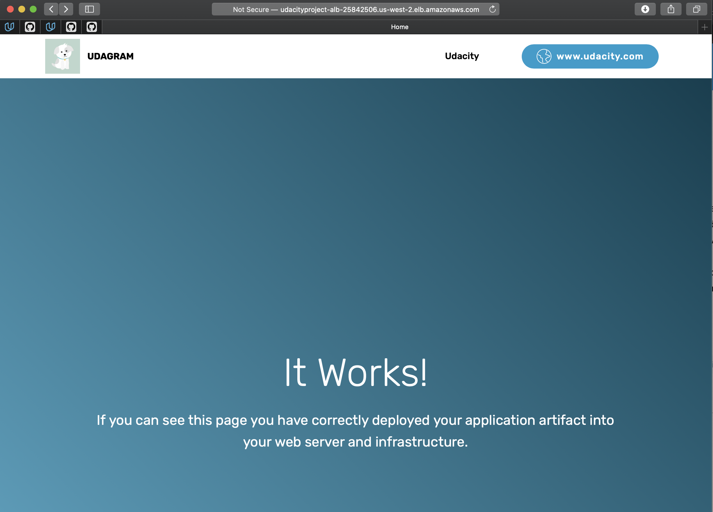

# Deploy Infrastructure as Code (IAC)
____

This project required configuring CloudFormation script to automatically deploy Infrastructure as Code.

___

## Server Requirements

A Launch Configuration was configured in order to deploy four servers, two located in each private subnets. All of which are used by an auto-scaling group. 

Furthur configuration includes two vCPUs with at least 4GB of RAM. The operating system used was Ubuntu 18 with at least 10GB of disk space. 

___

## Security Groups and Roles Requirements

Configuration of an IAM Role that allows the instance to use the S3 Service, when downloading the application archive from an S3 Bucket. 

The demo applicaation communicates on the default `HTTP PORT: 80`, so this port is open and used with the Load Balancer as well as the Load Balancer Health Check. The load balancer should allow all public traffic (0.0.0.0/0) on `port 80` inbound. Outbound, will only be using `port 80` to reach the internal servers. 

The application needs to be deployed into private subnets with a Load Balancer located in a public subnet. 

